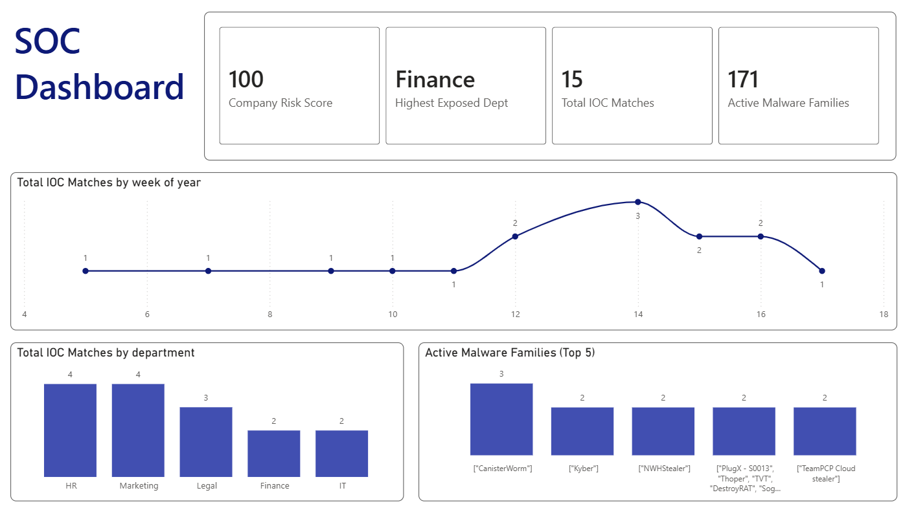
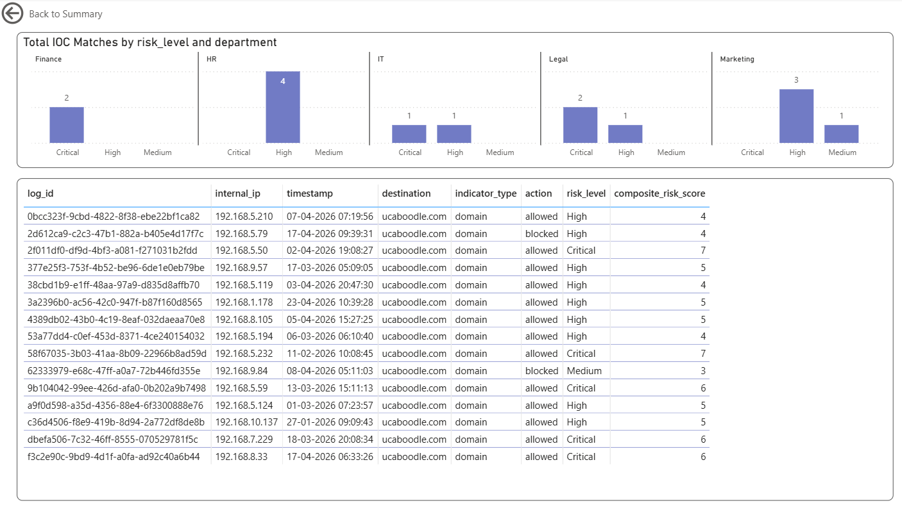

# Global Threat & Vulnerability Intelligence System

## Problem Statement
SOC teams face context-free alert fatigue. Thousands of alerts 
arrive daily with no correlation to global threat intelligence, 
forcing manual lookups across multiple tools with no unified view.

## Solution
An end-to-end data platform built on Microsoft Fabric that ingests 
live global threat intelligence from AlienVault OTX, correlates it 
against simulated internal company logs from BigQuery, and delivers 
a unified SOC dashboard in Power BI — reducing threat investigation 
time from 30 minutes to under 2 minutes.

## Key Metrics
- **8,131 records** ingested across 3 Bronze tables
- **250 threat pulses** and **6,881 IOC indicators** from live OTX API
- **2,535 correlation-target indicators** (domain, IPv4, URL, hostname)
- **15 confirmed IOC matches** against internal firewall logs
- **Company Risk Score: 100/100** — 13 of 15 threats unblocked
- **5 Critical events** identified across Finance, Legal and IT

## Architecture
OTX API ──────────────────────────────────────┐
▼
BigQuery (simulated logs) → Fabric Data Factory → OneLake
├── Bronze (raw)
├── Silver (clean)
└── Gold (star schema)
▼
Semantic Model
▼
Power BI SOC Dashboard

## What I Built

**Bronze Layer** — Raw ingestion from two sources. OTX API pulled 
via paginated REST calls. BigQuery firewall logs staged through GCS 
in Parquet format. All runs logged to pipeline_log Delta table.

**Silver Layer** — PySpark transformations: type casting, null 
handling, severity scoring, IOC correlation flagging. Zero nulls 
confirmed across all critical fields.

**Gold Layer** — Star schema with 4 dimension tables and 
fact_threat_events. IOC correlation join between internal logs and 
OTX indicators. Composite risk scoring model. 5 SQL views for 
business consumption.

**Semantic Model & Dashboard** — Direct Lake semantic model with 
6 DAX measures. Two-page Power BI report: Overview (SOC Manager) 
and Threat Event Detail (SOC Analyst) with drill-through.

## End Users
- **SOC Manager** — strategic risk oversight, company risk score, 
  department exposure, threat trends
- **SOC Analyst** — tactical IOC investigation, event-level detail, 
  evidence for escalation

## Tech Stack
- Microsoft Fabric (Lakehouse, Data Factory, Notebooks, 
  Semantic Model, Power BI)
- AlienVault OTX API (live threat intelligence)
- Google BigQuery + GCS (simulated internal log store)
- Python / PySpark / DAX / SQL
- GitHub (version control + project management)
- draw.io (architecture diagrams)

## Project Methodology
- Scrum-lite: 5 sprints, 2-week cadence
- DataOps: all notebooks and pipelines version controlled
- Medallion architecture: Bronze → Silver → Gold
- Agile delivery tracked via GitHub Projects
- Sprint retrospectives documented throughout

## Repository Structure
├── notebooks/          # Fabric PySpark notebooks
├── pipelines/          # Data Factory pipeline definitions
├── semantic-models/    # Semantic model exports
├── data-simulation/    # Synthetic log generator
├── reports/            # Power BI dashboard
└── docs/               # Architecture, data dictionary,# runbook, sprint retrospectives
